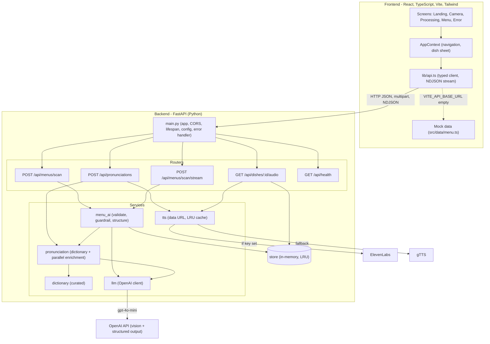
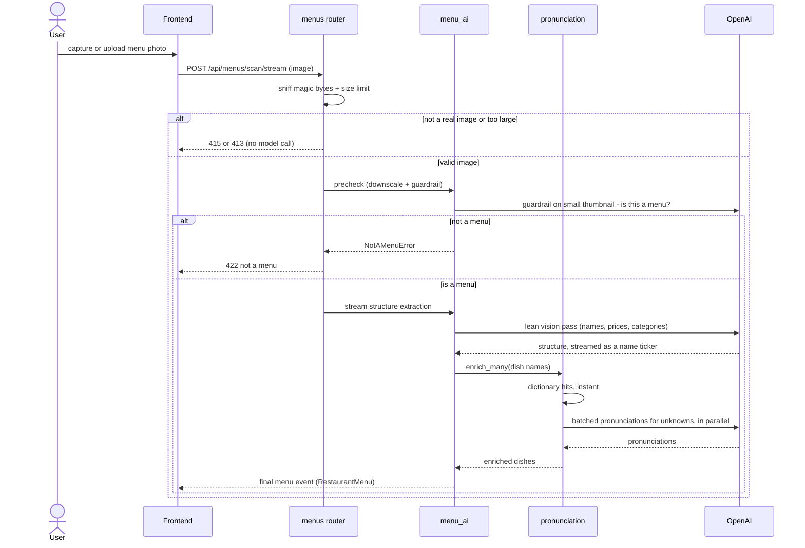

# WhatDish

**Live at [whatdish.pages.dev](https://whatdish.pages.dev/)**

Scan a restaurant menu and instantly learn how to say every dish. WhatDish reads
a menu photo and returns each dish with an English and Hindi pronunciation guide,
playable audio, cuisine, and price. It is built mobile-first, for diners facing
an unfamiliar menu who would rather not point and hope.

## Features

- Scan with the camera or upload a photo of any menu.
- English and Hindi (Devanagari) pronunciation for every recognized dish, with
  playable audio.
- Results stream in: dishes appear as they are recognized instead of waiting for
  the whole menu.
- An abuse guardrail rejects non-menu images before the expensive vision call, so
  the OpenAI key cannot be used as a general-purpose image processor.
- Works with zero configuration using built-in demo data, so the whole flow is
  usable before you add an API key.

## Tech stack

- Backend: FastAPI (Python), OpenAI vision for menu reading, gTTS or ElevenLabs
  for audio.
- Frontend: React, TypeScript, Vite, Tailwind CSS, Motion.

## Quick start

Requires Python 3, Node 18 or newer, and `make` (Docker optional).

```bash
make install    # set up backend + frontend + git hooks
make dev         # run both: API on :8000, web app on :5173
```

That is enough to run the app with demo data and no keys. To enable real menu
scanning, add an OpenAI key:

```bash
# backend/.env.local  (gitignored, never committed)
OPENAI_API_KEY=sk-...
```

Then restart `make dev`.

### Running backend and frontend separately

`make dev` runs both together. To see their logs in separate terminals, run each
target from the repository root (not from the subdirectories):

```bash
make backend     # terminal 1 - API on http://localhost:8000
make frontend    # terminal 2 - web app on http://localhost:5173
```

## Configuration

The active environment comes from `APP_ENV` (`development` by default, or
`production`) and is set by the Makefile or your deploy platform. Values are then
layered, highest priority first:

| Priority | Source | Committed | Purpose |
| --- | --- | --- | --- |
| 1 | real environment variables | no | deploy and CI overrides |
| 2 | `.env.<env>.local` | no | per-environment secrets |
| 3 | `.env.local` | no | secrets and overrides for all environments |
| 4 | `.env.<env>` | yes | non-secret per-environment defaults |

Put secrets in `backend/.env.local`. Non-secret per-environment defaults live in
the committed `backend/.env.development` and `backend/.env.production`.

| | Development (default) | Production |
| --- | --- | --- |
| Vision model | `gpt-4o-mini` | `gpt-4o-mini` (bump to `gpt-4o` for accuracy) |
| Guardrail model | `gpt-4o-mini` | `gpt-4o-mini` |
| API docs (`/docs`) | on | off |
| CORS | localhost | must be set explicitly |
| Log level | DEBUG | INFO |

See `backend/.env.example` for every supported variable.

## Architecture



### Menu scan flow

The scan runs in two phases so the menu appears fast: a lean vision pass reads
the structure, then pronunciations are enriched dictionary-first and, for unknown
dishes, via concurrent batched calls. Cheap checks gate the expensive call.



## API endpoints

| Method and path | Body | Returns |
| --- | --- | --- |
| `POST /api/menus/scan` | multipart, field `image` | `RestaurantMenu` (JSON) |
| `POST /api/menus/scan/stream` | multipart, field `image` | NDJSON stream: `dish` events, then a final `menu` event |
| `POST /api/pronunciations` | `{ "name": "..." }` | `PronunciationResult` |
| `GET /api/dishes/{id}/audio` | none | `{ "audioUrl": "..." }` |
| `GET /api/health` | none | status, env, model, aiEnabled |

Response shapes are camelCase and mirror the frontend's `src/types.ts`. Non-image
and oversized uploads are rejected before any model call (415 / 413); a real image
that is not a menu is rejected by the guardrail (422).

## Common commands

Run `make` with no arguments to list everything.

| Command | What it does |
| --- | --- |
| `make install` | First-time setup: backend, frontend, git hooks |
| `make dev` | Run backend and frontend together (development) |
| `make backend` | Run only the API (development, reload) |
| `make frontend` | Run only the web app (development) |
| `make test` | Run the backend test suite |
| `make build` | Production build of the frontend |
| `make start` | Run the API in production mode |
| `make clean` | Remove the venv, node_modules, and build output |

The `backend`, `dev`, and `start` targets free port 8000 first, so a stale
process never blocks a restart.

## Testing and CI

- `make test` runs the backend suite (pytest).
- A pre-commit hook runs scoped tests and typecheck on staged changes. Enable it
  with `make hooks` (included in `make install`); bypass a run with
  `git commit --no-verify`.
- GitHub Actions (`.github/workflows/ci.yml`) runs backend tests and frontend
  typecheck plus build on every pull request and on merge to `main`. On merge it
  also builds the backend Docker image and publishes it to GitHub Container
  Registry.

## Docker

The backend ships as a container image (`backend/Dockerfile`). Configuration and
secrets are provided at runtime, never baked into the image.

```bash
docker build -t whatdish-api backend
docker run -p 8000:8000 \
  -e OPENAI_API_KEY=sk-... \
  -e WHATDISH_CORS_ORIGINS=https://your-frontend.example.com \
  whatdish-api
```

CI publishes the image to `ghcr.io/<owner>/what_dish-api` (`latest` and a
per-commit `sha-...` tag) on merge to `main`.

## Project layout

```
backend/    FastAPI API: menu scanning, pronunciation, audio   (see backend/README.md)
frontend/   React web app: mobile-first scan-and-listen UI      (see frontend/README.md)
```

Both parts have their own README with endpoint details and internals.

## Production notes

- The backend runs as a single process today; the dish store and audio cache are
  in-memory and LRU-bounded. This is safe for a single instance. Scaling to
  multiple workers or instances requires moving that state to an external store
  such as Redis.
- Set `WHATDISH_CORS_ORIGINS` to the real frontend origin and provide keys via
  the environment or a secret manager. Never commit secrets.
- Add rate limiting before exposing the OpenAI-backed endpoints publicly.
